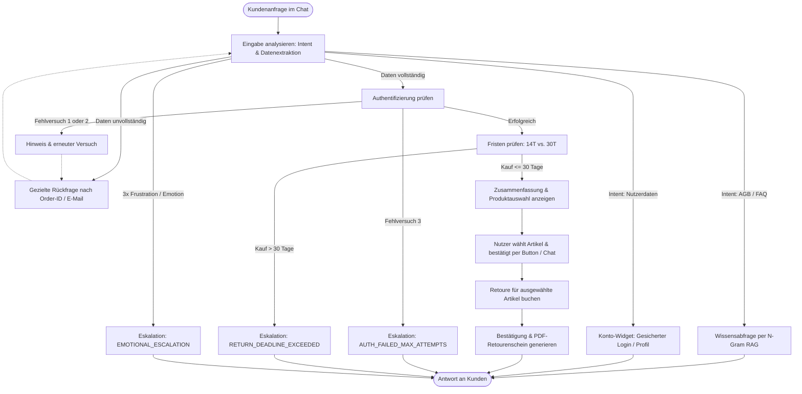

# KI-gestützter Kundenservice-Agent zur Retourenabwicklung

Ein Prototyp für einen Kundenservice-Agenten im E-Commerce zur automatisierten Bearbeitung von Retouren, Beantwortung von Richtlinienfragen und Verwaltung von Kundendaten. Das System kombiniert deterministische Geschäftslogik, Retrieval-Augmented Generation (RAG), ein Rollen- und Berechtigungskonzept sowie eine geordnete Human-in-the-Loop-Eskalation mit einem interaktiven Web-Frontend.


## 1. Motivation und Problemstellung

Im herkömmlichen Kundenservice führen Retourenanfragen häufig zu Medienbrüchen und langen Wartezeiten. Kunden müssen im Kundenkonto manuell nach Optionen suchen, weichen bei Rückfragen auf Telefon oder E-Mail aus und müssen sich bei Weiterleitungen mehrfach authentifizieren. Fehlen Notizen im System, muss das Anliegen wiederholt geschildert werden. Dies verursacht hohe Bearbeitungskosten (Average Handling Time) und bindet Support-Kapazitäten für monotone Standardaufgaben.

Das Ziel dieses Systems ist ein rund um die Uhr verfügbarer Service-Agent, der:
* freitextliche Anliegen per Intent-Erkennung semantisch versteht,
* bei allgemeinen Fragen auf Wissensqüllen (AGB / FAQs) per RAG zugreift,
* Kunden sicher authentifiziert und deterministische Backend-Aktionen (Fristprüfung, Buchung) ausführt,
* bei Fristüberschreitungen, mehrfachen Fehleingaben oder emotional aufgeladenen Dialogen strukturiert an menschliche Support-Mitarbeiter übergibt.

Messbare Zielgrössen sind die Steigerung der Erstlösungsquote (First Contact Resolution), die Entlastung des Contact Centers und eine schnelle, fehlerfreie Abwicklung von Standardretouren.


## 2. Prototypische Umsetzung (Schritt 4)

Der Prototyp deckt einen klar abgegrenzten Kernpfad mit Integrationen und zwei wesentlichen Ausnahmefällen ab:

### Kernpfad (Happy Path & Teilretouren-Auswahl)
1. **Eingabe verstehen**: Der Kunde äussert ein Retourenanliegen im Freitext und nennt Bestellnummer (z. B. `ORD-1001`) sowie E-Mail-Adresse (`kunde1@example.com`).
2. **Strukturierte Erhebung & Validierung**: Das System extrahiert Intent und Entitäten. Ein Mock-Backend prüft die Übereinstimmung von Bestellnummer und E-Mail.
3. **Regelanwendung & Zusammenfassung**: Das Bestelldatum wird ausgelesen und die Fristen werden geprüft (`<= 14 Tage`: Erstattung auf Zahlungsmittel; `15-30 Tage`: Store-Credit Warengutschein).
4. **Interaktive Produktauswahl & Bestätigung**:
   - Das System bucht **nicht** voreilig automatisch die gesamte Bestellung, sondern präsentiert eine Zusammenfassung aller bestellten Artikel.
   - Der Kunde kann über eine interaktive **Action Card mit Checkboxen** (oder per Chat-Nachricht wie *„Nur den Bürostuhl zurückgeben“*) auswählen, welche Produkte retourniert werden sollen.
   - Die Erstattungssumme aktualisiert sich live bei der Auswahl.
   - Erst nach Klick auf den Button **„Retoure verbindlich abschließen“** (oder Chat-Bestätigung) wird die Retoure gebucht.
5. **Erfolgsnachricht & PDF-Musterbeleg**:
   - Das System bucht die Retoure (`RET-...`) für genau die ausgewählten Artikel.
   - Ein standardkonformer **PDF-Retourenbegleitschein** (`/api/returns/{return_id}/label.pdf`) wird dynamisch generiert und kann über den Button direkt im Browser geöffnet oder heruntergeladen werden. Der Beleg enthält Barcode, Retouren-ID, Bestelldaten, Absender/Empfänger sowie eine detaillierte Tabelle der retournierten Artikel mit Einzel- und Gesamterstattungssumme.

### Ausnahmefall 1: Fristprüfung / Geschäftsregel (Kulanzfrist)
* Die Bestelldaten sind gültig, das Kaufdatum liegt jedoch zwischen 15 und 30 Tagen zurück (z. B. `ORD-1002`).
* Die Geschäftsregel wird deterministisch angewendet: Es erfolgt keine Auszahlung, sondern eine Erstattung als Warengutschein (`return_type="store_credit"`).
* Der Kunde wird transparent über die Richtlinie informiert, wählt die Artikel aus und erhält nach Bestätigung sein Store-Credit-Label.

### Ausnahmefall 2: Validierungsfehlschlag, Fristüberschreitung oder Emotionale Eskalation
* **Frist > 30 Tage** (z. B. `ORD-1003`): Die reguläre Frist ist abgelaufen. Der Agent lehnt eine automatisierte Buchung ab und leitet eine Prüfung auf Kulanz ein.
* **Authentifizierungs-Fehlversuche**: Nach 3 fehlerhaften Authentifizierungsversuchen bricht das System die automatische Verarbeitung ab, um Missbrauch zu verhindern.
* **Emotionale Kundenreaktion**: Bei wiederholt verstärkter Unzufriedenheit oder Frustration (ab 3 emotional geladenen Nachrichten) erkennt das System den Eskalationsbedarf.
* **Eskalationsmechanismus**: Schreibende Tools werden für die Session gesperrt (`tools_locked = True`). Es wird ein vollständiger `HandoffPayload` für externe Ticketing-Systeme (Zendesk, Salesforce) mit Case-ID, Bestellnummer, Grund, Zusammenfassung, Handlungsempfehlung und Chatverlauf erzeugt.

### N-Gram-basierte AGB-Wissensabfrage (RAG)
* Anstelle fehleranfälliger einfacher Wortübereinstimmungen verwendet der RAG-Retriever ein **N-Gram-BM25-Verfahren**:
  * **Wort-N-Gramme (1- und 2-Gramme)** für Phrasen (*„store credit“*, *„30 tage“*).
  * **Zeichen-N-Gramme (3- und 4-Gramme)** für deutsche Komposita (*„Rücksendekosten“*, *„Zahlungsmodalitäten“*, *„Gewährleistungsfrist“*).
  * TF-IDF/BM25-Gewichtung mit Dokumentlängennormalisierung und Paragraphen-Boost.

### Mock-Backend & Protokollierung
* Als relationale Datenbasis dient eine strukturierte In-Memory-Datenbank für Bestellungen, Bestelldetails und Kundenkonten.
* Sämtliche Zustände, Knotenwechsel, Tool-Aufrufe und Entscheidungslogiken werden transparent im State-Cockpit protokolliert und können live eingesehen werden.


## 3. Zielprozess und Conversation Flow




## 4. Architektur und Abgrenzung

Die Systemarchitektur trennt Aufgaben strikt nach Logiktypen, um Halluzinationen bei Geschäftsentscheidungen auszuschliessen:

### 1. Deterministische Logik
* **Berechnungen & Geschäftsregeln**: Die Fristenberechnung (Kaufdatum zu aktuellem Datum: `<= 14 Tage` = Erstattung, `15-30 Tage` = Store Credit, `> 30 Tage` = Ablehnung/Eskalation) erfolgt rein programmgesteuert in Python ohne Beteiligung eines Sprachmodells.
* **Authentifizierung & Datenabgleich**: Der Abgleich von Kundeneingaben mit der Datenbank läuft über strikte Gleichheitsprüfungen.
* **Schreiboperationen**: Das Erzeugen der Retoure (`RET-...`) und des Labels erfolgt deterministisch.
* **Sicherheitsverriegelung**: Nach einer Eskalation wird das Flag `tools_locked = True` gesetzt; nachfolgende schreibende Aktionen werden serverseitig blockiert.

### 2. Generative KI & Hybrid-Architektur
* **Hybrid-Ansatz mit dem Laya-Modell**: Für die Eingabeanalyse setzt das System primär auf das leichtgewichtige, spezialisierte **Laya-Modell** (`laya.Router` und `laya.lang.analyse`):
  * **Sub-Millisekunden-Klassifikation**: Absichten (Intents wie *Retoure*, *AGB*, *Nutzerdaten*, *Greeting*, *Off-Topic*), Sprache (DE, EN) und Frustration/Sentiment werden lokal in unter 10 ms klassifiziert.
  * **Token- & Kosteneinsparung**: Da kein autoregressives LLM für reine Intent- und Sentiment-Entscheidungen mit Prompt-Templates aufgerufen werden muss, spart das System API-Tokens und reduziert die Antwortlatenz für den Nutzer drastisch.
  * **Zero-Hallucination bei Identifikatoren**: Bestellnummern (`ORD-...`) und E-Mail-Adressen werden zusätzlich über deterministische reguläre Ausdrücke validiert.
* **Zielgerichteter LLM-Einsatz**: Generative Sprachmodelle werden erst dann hinzugezogen, wenn freie Textgenerierung zwingend erforderlich ist:
  * **RAG-Synthese**: Beantwortung komplexer Richtlinienfragen auf Basis semantisch abgerufener Abschnitte aus den AGBs.
  * **Handoff-Zusammenfassung**: Prägnante Verdichtung des Verlaufs und Formulierung einer Handlungsempfehlung für menschliche Support-Agenten im Eskalationsfall.
  * **Natürlichsprachliche Dialoge**: Formulierung kundenfreundlicher, lokalisierter Antworten.

### 3. Agentische Steuerung
* **Zustandsbasierter Kontrollfluss**: Ein zustandsbehafteter Graph (LangGraph) steuert die Navigation zwischen den Knoten anhand des aktuellen Dialog- und Systemstatus.
* **Dynamisches Routing**: Abhängig vom Intent und den vorhandenen Daten entscheidet der Graph dynamisch, ob Rückfragen nötig sind, die Authentifizierung gestartet wird oder in Richtlinien- bzw. Kontoverwaltungszustände verzweigt wird.
* **Multi-Turn State**: Der Dialogzustand bleibt über mehrere Interaktionen pro Thread erhalten.

### Rollen- und Berechtigungskonzept (Least Privilege)
Um unbefugten Zugriff auf Kundendaten zu verhindern, sind Tools in abgestufte Berechtigungsstufen unterteilt:
* **searchFAQ(query)**: Rein lesender Zugriff auf die Wissensdatenbank; öffentlich ohne Authentifizierung nutzbar.
* **verifyOrderCustomer(order_id, email)**: Lesender Prüfaufruf. Erfordert die Übereinstimmung beider Identifikatoren mit der Datenbank.
* **getOrderDetails(order_id)**: Lesender Zugriff auf Bestelldatum, Artikel und Fristen. Nur nach erfolgreicher Authentifizierung aufrufbar.
* **createReturnBooking(order_id, return_type)**: Schreibender Zugriff zur Buchung der Retoure und Erzeugung des Labels. Nur mit gültigem Authentifizierungsstatus zulässig; bei aktiver Tool-Sperre blockiert.
* **Kritische Account-Daten**: Sensible Kontodaten (Passwort, Login) werden über ein separates, geschütztes Widget direkt an das Backend übermittelt, ohne über externe Drittanbieter-LLMs geleitet zu werden (Zero-LLM-Leakage).


## 5. Lokale Installation und Ausführung

### Voraussetzungen
* Python 3.11 oder neuer
* Git

### Schritt-für-Schritt-Anleitung

#### 1. Repository klonen und Verzeichnis betreten
```bash
git clone <repository-url>
cd MiniUseCase
```

#### 2. Virtuelle Umgebung erstellen und aktivieren
```bash
# Virtuelle Umgebung erstellen
python3 -m venv .venv

# Aktivieren unter macOS / Linux:
source .venv/bin/activate

# Aktivieren unter Windows (PowerShell):
.venv\Scripts\Activate.ps1
```

#### 3. Abhängigkeiten installieren
```bash
pip install --upgrade pip
pip install -r requirements.txt
```

#### 4. Anwendung starten
```bash
python main.py
```
Der Server startet unter `http://127.0.0.1:8000`. Die Anwendung öffnet sich automatisch im Standard-Webbrowser.


## 6. Testausführung und Validierung

Das Projekt enthält sowohl modulare Unit- und Integrationstests sowie automatisierte Testszenarien:

### A. Modulare Test-Suite (pytest)
Umfasst 20 Tests für Retouren-Flows, Fristgrenzen, Authentifizierung, Sentiment-Eskalation und Account-Verwaltung im Verzeichnis `tests/`:
```bash
pytest
```
Alternativ über das Python-Standardmodul:
```bash
python -m unittest discover -s tests
```

### B. Automatisierte Szenarien
Führt die 4 vorgegebenen Testfälle automatisiert durch und validiert die Ausführung über Assertions:
```bash
python main.py --test
```
* **Fall 1**: Happy Path (<= 14 Tage) -> Rückzahlung (`refund`)
* **Fall 2**: Kulanzfrist (15-30 Tage) -> Warengutschein (`store_credit`)
* **Fall 3**: Frist abgelaufen (> 30 Tage) -> Eskalation (`RETURN_DEADLINE_EXCEEDED`)
* **Fall 4**: 3x Auth-Fehlschlag -> Sicherheitsverriegelung & Handoff (`AUTH_FAILED_MAX_ATTEMPTS`)
* **Fall 5**: Nutzerdaten Anpassen -> Login Widget
* **Fall 6**: AGB Richtlinien abfragen -> RAG


## 7. Web-Frontend & Testmöglichkeiten

Das Web-Frontend bietet zwei Ansichten:
1. **Auditor Split (Standard)**:
   * **Links**: Kundenservice-Chat mit dynamischen Widgets (Label-Download, Anmelde-Widget, Handoff-Status)
   * **Rechts (State-Cockpit)**: Live-Einblick in den aktuellen Graph-Knoten, Intent-Konfidenz, Authentifizierungsstatus, Frustrations-Count, Tool-Sperre, deterministische Entscheidungslogik und Ausführungs-Logs.
2. **Floating Customer Widget**:
   * Simuliert ein typisches Support-Widget auf einer Storefront. Ein Klick auf das Vergrössern-Symbol schaltet nahtlos in die Auditor-Ansicht um.

Über das Menü (Button "Menü & Tests") können Test-Szenarien per Klick simuliert werden. Standardmässig läuft das System vollständig lokal im autarken Mock-Modus. Optional kann in den Einstellungen ein eigener API-Key (für OpenAI-kompatible Modelle) eingetragen werden.
